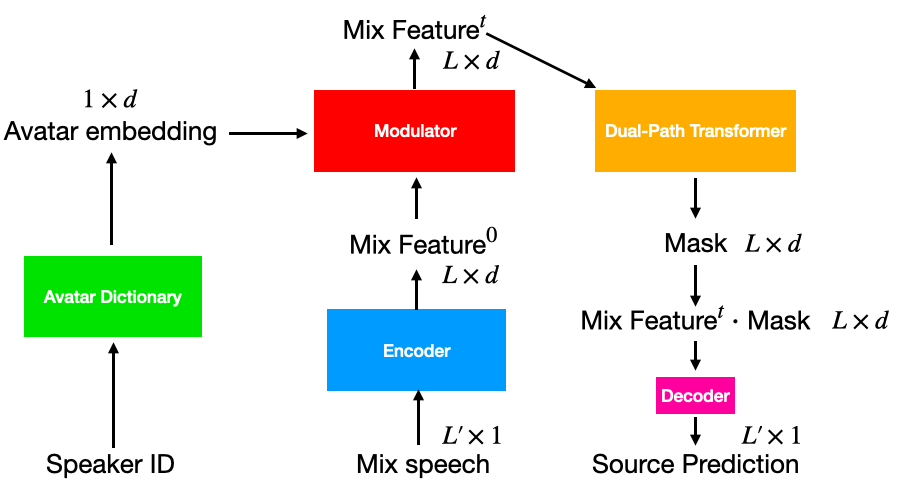

# Avatar-based speech separation by Upload AI LLC

--------------------------------------------------------------------------------

The idea is based on [Dual-path Transformer](https://arxiv.org/abs/2007.13975). We add a modulator to incorporate speaker information and thus achieve personalized speech models. The overview of the model architecture is shown below.


## Contents
- [Prerequisites](#prerequisites)
- [Running code](#how-to-run-the-code)
- [Check results](#check-results)

## Prerequisites
([↑up to contents](#contents))
1. Download the `Avatar10Mix2` dataset, which contains audios recorded from 10 speakers:
```bash
cd datasets
sh download_avatar10mix2.sh
cd ..
```
2. Install dependencies:
```bash
pip install -r requirements.txt
```

## How to run the code
([↑up to contents](#contents))
The training and testing code for separating speech from ambient noise is provided in `speech_vs_ambient`.
Change the directory to `speech_vs_ambient` and run the following commands:
1. Training
```bash
python train.py --exp_dir exp/speech_vs_ambient
```
1. Testing
```bash
python eval.py --exp_dir exp/speech_vs_ambient
```

## Check results
([↑up to contents](#contents))
We provide a simple webpage to review good test examples, which can be found at 
```bash
exp/speech_vs_ambient/vis/examples/
```
The training curves are logged with Tensorboard. To view them, run 
```bash
tensorboard --logdir exp/speech_vs_ambient/lightning_logs/
```
